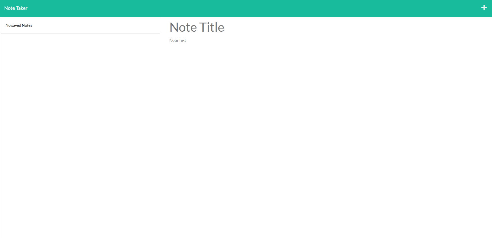
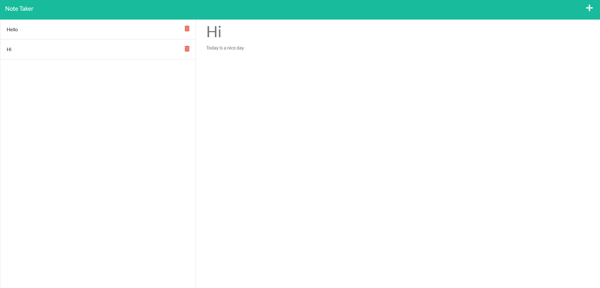

# note-taker

## Description

This is a note taking app. When you click on get notes it opens up a new page with all of your old notes and a box where you can enter a new note. When you enter a new note you can save it with the save button on the top and it saves it to the left column. You can then click on any of your old notes and they will pop up into the right column. When your old note is in the right column, you can press on the plus icon in the top right to create a new note. The delete button does not work right now and will eventually work in the future.

## Installation

To install this app all you have to do is clone the repository, and then run npm i and it will install everything that you need.

## Usage 

To use this app you need to type npm start into the console or you can visit the webpage it is deployed to.

## Screenshot

## Contact Me

Email: zane.scheel@gmail.com